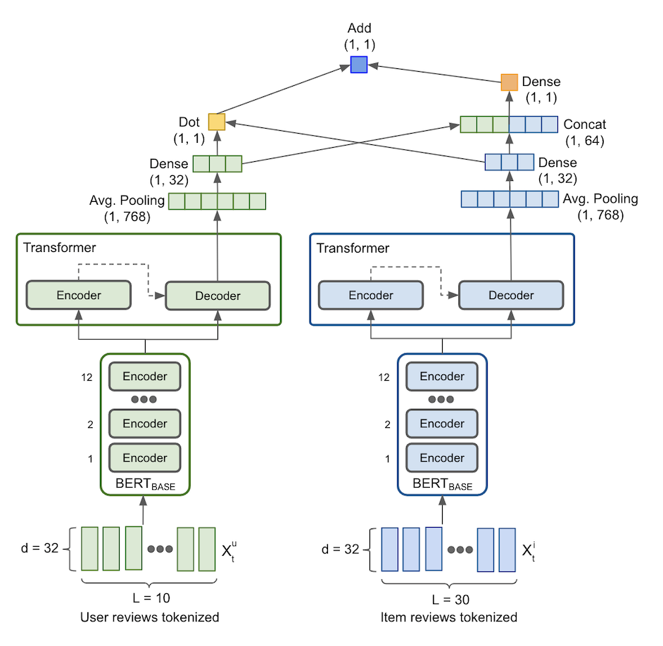
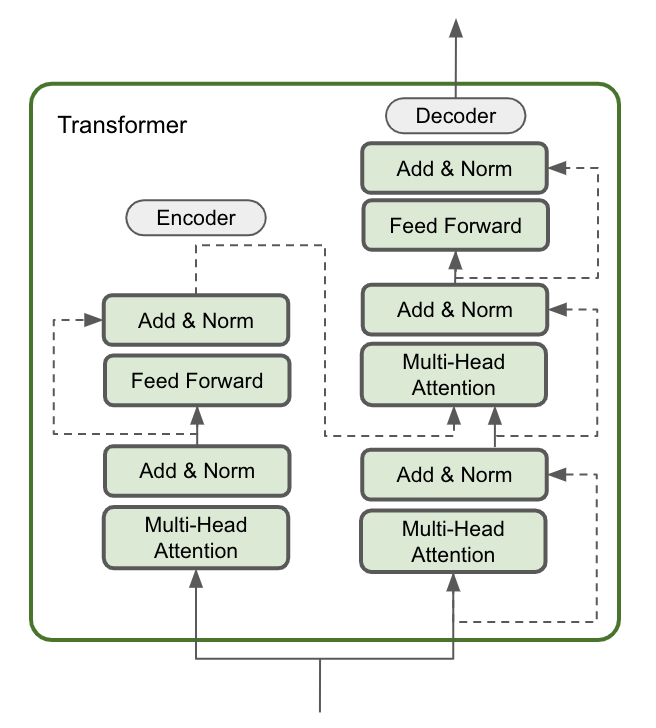

Another (Ensemble) Transformer-Based Recommendation Model on Users-Items Interaction using Reviews
=======================================

   

#### Authors : [Triaji (Sony) Wicaksono](https://www.linkedin.com/in/triaji-cahyo-wicaksono-68a17029/) | [Sean Campos](https://www.linkedin.com/in/sean-campos/)

 

U.C. Berkeley, Masters in Information & Data Science program - [datascience@berkeley](https://datascience.berkeley.edu/)  
Spring 2021, W266 - <i>Natural Language Processing</i> - [Daniel Cer, PhD](https://www.ischool.berkeley.edu/people/daniel-cer) | [Mark Buttler, PhD](https://www.ischool.berkeley.edu/people/mark-butler)   

---

## Description

Recommendation systems typically come in two forms: Collaborative Filtering (similarity between users' preferences) and Content-Based Filtering (comparison between the properties of the items and users profile), however both of these approaches leave out the valuable information contained in user sourced reviews. We introduce an Ensemble Transformer Model producing users and items review embeddings that are well suited for recommendation tasks. We propose the Two-tower BERTBASE model as our baseline model, and incrementally augment that with Transformer model(s) to improve performance with the cost of complexity and computational resources. We evaluate both _feature-based_ on different poolings and _fine-tuning_ strategies to learn latent feature representation of users and items reviews performing such downstream tasks.

All the models were trained and evaluated using [Amazon](http://deepyeti.ucsd.edu/jianmo/amazon/index.html) on Movies and TV category, and [Yelp](https://www.yelp.com/dataset) dataset predicting ratings on group of users and items reviews. Our models capture user interaction with different items on the posted reviews and eliminates the cold-start problem on new user as it learns other users's reviews on an item.

<table style="border-collapse: collapse; border: none;">
  <tr>
    <td></td>
    <td></td>
  </tr>
  <tr>
    <td align='center'>Fig 1. Architecture Diagram</td>
    <td align='center'>Fig 2. Transformer Block</td>
  </tr>
 </table>

 #### Hightlight of key files

 | File | Description |
 |:---- | :---------- |
 | [Final Paper (ACL 2020 Format)]() | Final write-up and submission for review of analysis and findings in ACL 2020 format. |
 | [BERT embeddings generation](https://github.com/sony-w/RecommendationTransformer/blob/main/bert_embedding_colab.ipynb) | Jupyter notebook that outlines the generation of BERT embeddings on different pooling strategies. |
 | [Fine-tuning two-tower BERT model](https://github.com/sony-w/RecommendationTransformer/blob/main/bert_fine-tuning_training_colab.ipynb) | Jupyter notebook that outlines fine-tuning approach on two-tower BERT model. |
 | [Fine-tuning two-tower BERT + Transformer](https://github.com/sony-w/RecommendationTransformer/blob/main/bert-transformer_fine-tuning_training_colab.ipynb) | Jupyter notebook that outlines fine-tuning approach on two-tower BERT + Transformer model. |
 | [Pooling Strategies Notebook](https://github.com/sony-w/RecommendationTransformer/blob/main/Pooling%20Strategies/DeepCoNN_BERT_Pooling_Strategies.ipynb) | Jupyter notebook that tests different pooling strategies on the BERTbase pre-trained model. |  
| [Baseline BERTbase and Mean Pooling Notebook](https://github.com/sony-w/RecommendationTransformer/blob/main/Pre-Trained%20Models/DeepCoNN-BERT-MeanPool-Baseline.ipynb) | Jupyter notebook for the baseline model. |  
| [Pre-Trained Models Folder](https://github.com/sony-w/RecommendationTransformer/tree/main/Pre-Trained%20Models) | Jupyter notebooks for each of the pre-trained models. |  
